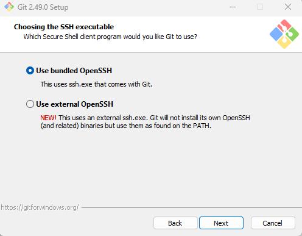
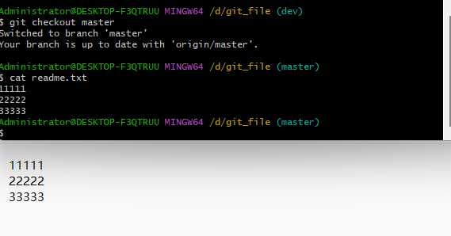
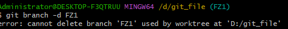

# gGit笔记

[包新的Git安装与使用教程（2024九月更新）_git安装包-CSDN博客](https://blog.csdn.net/Amliy_lin/article/details/141962233)

## 一、Git下载


## 二、Git安装


```
选择自己的安装路径，如下：
```


```
红框内要注意勾选
```


```
这里注意勾选Use Git from Git Bash only
```





### 2.2 环境变量配置与测试

安装完之后进行环境配置，在任意文件夹下右键--->显示更多选项--->Open Git Bash here


输入以下内容：

```shell
git config --global user.name "your_name"
```

按回车后接着输入:

```shell
git config --global user.email "your_email"
```

完成后如下图所示


**注意：要填自己真实的邮箱**

因为 Git 是分布式版本控制系统，所以需要填写用户名和邮箱作为一个标识，git config --global 参数，有了这个参数，表示你这台机器上所有的 Git 仓库都会使用这个配置，当然你也可以对某个仓库指定的不同的用户名和邮箱。
这样，我们的 Git 客户端就下载并安装完成了。

## 三、Git使用教程

### **3.1 创建版本库**

**首先让地址定位到你想作为仓库地址目录的地方**

```
1.直接在文件目录右键--->显示更多选项--->Open Git Bash here
```


```
2.或通过指令创建一个文件目录并导航进去
·首先通过CD命令定位到对应磁盘中(如D盘)
·使用mkdir filename命令在当前盘下创建一个文件夹
·通过cd命令定位到我们刚创建的文件夹
```


```
3.前面两个方法我们成功将当前地址倒向了我们创建的文件夹
通过命令git Init把这个目录变成git可以管理的目录
```


```
4.此时你的git_file文件目录下便会多一个.git的文件夹，这个文件夹这个目录是 Git 来跟踪管理版本的，没事千万不要手动乱改这个目录里面的文件，否则会把 git 仓库给破坏了，如下：
```


### 3.2 向版本库添加文件

```
快捷指令：
git add filename //将文件加入暂存区
git commit -m "注释"//上传文件并给予注释
git status//查看仓库的状态
git diff filename//查看该文件哪里被修改
```

**前提：在版本库git_file目录下新建一个记事本文件readme.txt,并输入一些内容在里面，比如：1111**


```
1.使用命令 git add readme.txt 添加到暂存区里面去，如下：
(如果没有任何提示，说明已经添加成功了)
```


```
2.用命令 git commit-m "注释内容"(注释里面的内容不设要求，自己能明白就行)告诉Git，把文件提交到仓库
```


```
3.此时已经提交成功了，接下来我们可以看一下是否还有文件没有提交，使用命令git status,如下：
(出现如下字样，说明已经全部提交了)
```


```
4.当我们对readme.txt文件进行修改，在其内容后面添加一行22222的内容，继续使用git status进行状态查看，如下：
```


```
5.从提示内容可知，readme.txt文件的内容已经被修改，但是还未提交到仓库里面，如果想要查看文件里面究竟修改了什么内容，可以使用命令git diff readme.txt进行查看，如下：
(可以看到红色字体是修改前的内容，绿色字体是修改之后的内容)
```


```
6.确认修改了什么内容后我们就可以放心提交到仓库了，提交修改后的文件和前面说的提交文件是一样的操作，第一步是把文件放入暂存区，第二步是提交文件到仓库，使用命令git commit -m "注释"，如下：
```


```
7.以上两步完成以后可以再看一下是否还有文件没有提交，使用git status进行查看，如下：
```


### 3.3 版本回退

```
快捷指令：
git log//查看详细的历史修改信息
git reflog//查看简化的历史修改信息
git reset --hard HEAD^//有多少个^就回退多少版本
git reset --hard 版本号//用于回溯到指定版本
```


```
1.我们对readme.txt文件再次进行修改，在后面添加一行内容33333，并提交到仓库，如下：
```


```
2.如果我们不想要当前的版本，怎样才能换回以前的呢？
我们可以先使用git log来查看一下之前的历史记录，使用命令git log即可查看，如下：
```


```
3.我们可以看到，历史记录从上到下是从修改时间由近到远排列的，在上面可以看到修改的时间以及修改人的信息，如果觉得信息太多的话，我们可以使用命令git reflog或者git log --pretty=oneline进行简化，如下：
```


```
4.回退到之前的版本
第一种：使用命令git reset --hard HEAD^，这条命令的作用是回退到上一个版本，如果要回退到上上个版本，要使用命令git reset --hard HEAD^^，以此类推；

第二种：第一种方法只适用于要退回的版本不远的情况，如果要退回前100个版本的话是非常不方便的，此时我们可以使用git reset --hard HEAD~100命令即可。

现在回退到上一个版本
```


```
5.可以看到git log已经查不到之前的版本了，文件里面内容也变了
```


```
6.如何恢复版本号
·使用git reflog查看回退前的版本号
·使用git reset --hard 版本号来恢复
.使用cat readme.txt来查看文件里面的内容
```


### 3.4 删除和恢复文件

```
快捷指令：
1.直接手动删除
2.rm 文件名命令//命令删除
3.使用git restore c.txt恢复删除的文件//前提是版本库中还有它
```

前提：现在我们在版本库git_file目录里面添加一个文件c.txt，然后提交，如下：


```
1.这时候我们手动删除c.txt或者rm c.txt删除
(可以看到本地目录下c.txt已经没有了，这时候如果commit一下，云库里面也就没了)
```


```
2.这里我们删除了c.txt,在没有commit之前，可以使用git restore命令来恢复
```


```
3.注意这里我们删除了c.txt后，还要提示一下版本库我们对哪个文件进行了修改操作(使用add命令)，commit之后，我们再想恢复c.txt就无法恢复了
```


### 3.5 远程仓库

```
现在我们已经在本地创建了一个 Git 仓库，又想让其他人来协作开发，此时就可以把本地仓库同步到远程仓库，同时还增加了本地仓库的一个备份。

常用的远程仓库就是 github：https://github.com/，接下来我们演示如何将本地代码同步到github。
在 github 上创建仓库：
```


```
点击“create repository”按钮仓库就创建成功了。
Github 支持两种同步方式“https”和“ssh”。
如果使用 https 很简单基本不需要配置就可以使用，但是每次提交代码和下载代码时都需要输入用户名和密码。
如果使用 ssh 方式就需要客户端先生成一个密钥对，即一个公钥一个私钥。然后还需要把公钥放到 githib 的服务器上。
```


### 3.6 SSH密钥的生成

**什么是SSH？**

```
SSH 为 Secure Shell（安全外壳协议）的缩写，由 IETF 的网络小组（Network Working Group）所制定。SSH 是目前较可靠，专为远程登录会话和其他网络服务提供安全性的协议，利用 SSH 协议可以有效防止远程管理过程中的信息泄露问题。
```

**ssh密钥的生成和配置**

```
第一步：创建 SSH Key。在用户主目录下，看看有没有.ssh 目录，如果有，再看看这个目录下有没有 id_rsa 和 id_rsa.pub 这两个文件，如果有的话，直接跳过此如下命令。
如果没有的话，打开命令行，输入如下命令：git bash，执行命令；
生成公钥和私钥，命令: ssh-keygen -t rsa。
```


```
如图可见我们的用户目录下是有.ssh文件的，但是.ssh文件下没有 id_rsa 和 id_rsa.pub 这两个文件。因此我们需要调用ssh-keygen -t rsa生成公钥和私钥。
```


```
然后我们可以根据路径找到我们的公钥和私钥
```


### **3.7 SSH密钥的配置**

```
密钥生成后需要在 github 上配置密钥本地才可以顺利访问。
```


```
接着打开你的id_rsa.pub（公钥）文件，可以用记事本打开，并把里面的内容全部复制下来，粘贴在Key的部分，然后点击Add SSH key按钮完成配置。
```


### 3.8 同步到远程仓库

**同步到远程仓库可以使用 git bash。**
**现在，我们根据 GitHub 的提示，在本地的git_file仓库下（D:\git_file）运行命令：**

```
git remote add origin https://github.com/Indomitable412/First_lib.git
git push -u origin master 

//同步成功后，之后git push origin 分支名可以上传到远程仓库
```


```
出现以下提示表示链接成功了，我们也可以通过网页来查看我们是否连接成功
```


```
注意如果出现以下错误
```


```
这说明你之前已经连接过你的远程仓库了，我们可以执行git remote rm origin指令，再执行以上两条指令，效果如下：
```


### 3.9 创建和合并分支branch

```
快捷命令：
查看分支：git branch
创建分支：git branch name
切换分支：git checkout name
创建+切换分支：git checkout –b name
合并某分支到当前分支：git merge name
删除分支：git branch –d name
```

**所为分支就好像是小说中的另一条时间线一样。截止目前我们都是在主时间线main上操作，此篇章我们将创建一个分支时间线，并实现时间线的"合并"。**


```
1.首先，我们来创建dev分支，然后切换到dev分支上，如下操作：
git checkout 命令加上 –b 参数表示创建并切换，相当于如下 2 条命令：
git branch dev
git checkout dev
git branch 查看分支，会列出所有的分支，当前分支前面会添加一个星号。
```


```
2.当前以及切换到了dev分支，接下来我们修改readme.txt文件上添加一行44444，我们可以查看下readme.txt的内容，接着提交。
```


```
3.再切换回master分支，效果如下：
可见readme的版本(也就是时间线)已经回到了我们的主线
```



```
4.可以看到两条分支上面的内容并不一样，现在我们可以把 dev 分支上的内容合并到分支 master 上了，可以在 master 分支上，使用如下命令 git merge dev 如下所示：
(可以看到这两条分支上面的内容完全一样了，也就是说支线成了真结局？)
```


```
5.合并完成后，我们可以接着删除dev分支了
这样就算删除好了
```


### 3.10 如何从远程库克隆

```
当我们想从GitHub上面下载某个项目到我们本地仓库上面时
```


### 3.12 一对多?如何理解版本库和远程库之间的关系？

版本库：在本地中使用git init命令以及git commit将本地文件与版本库关联，受到设备限制

远程库：需关联版本库，就是网页上那种显示，不受设备限制，可以随时随地下载

一、在没有分配权限给其他人的情况下

对于创建者来说，版本库和远程库之间的关系是一对一的，一旦版本库绑定了一个远程库，那么这个远程库就不能再绑定其他版本库？

## 四、总结


## 五、补充

```
1.不能删除正在使用的branch分支，需要先切换分支再删除
```



```
2.当同时修改了a和b文件，若我们只将a加入暂存区并提交，那么只会提交a的修改，这一点也可以通过git status反映出来
```


